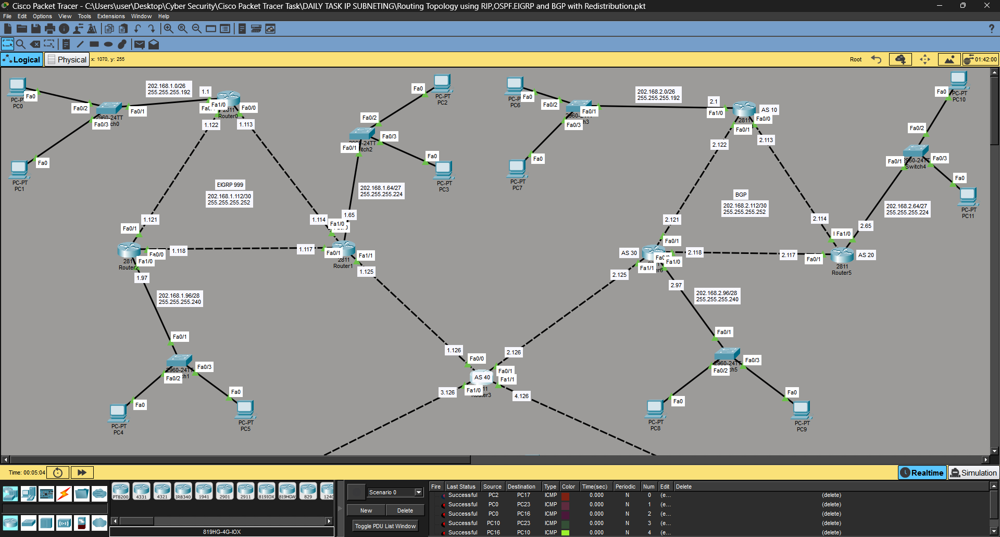
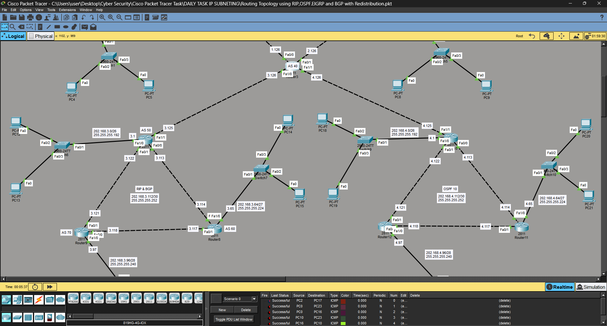
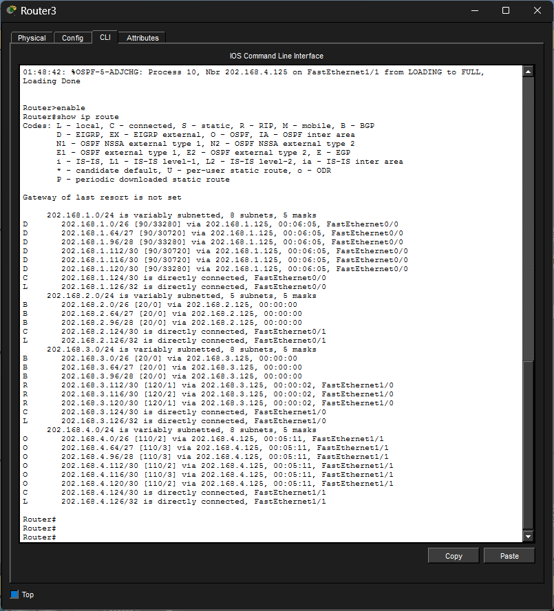
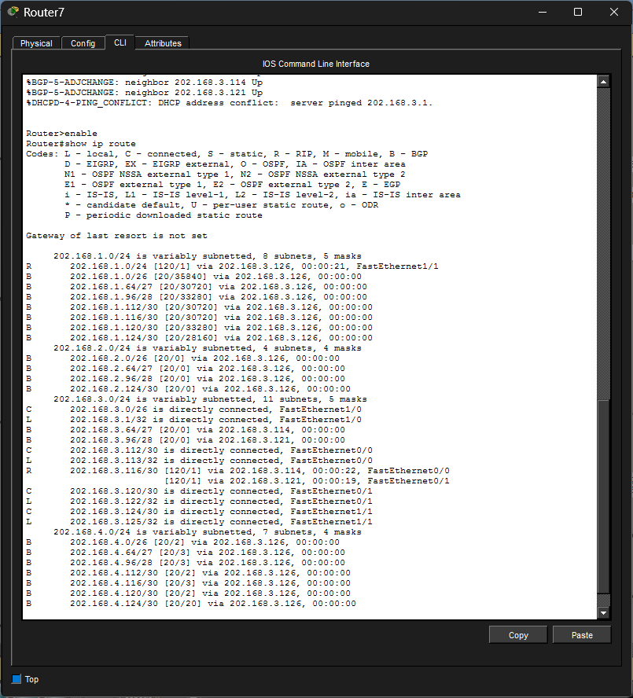
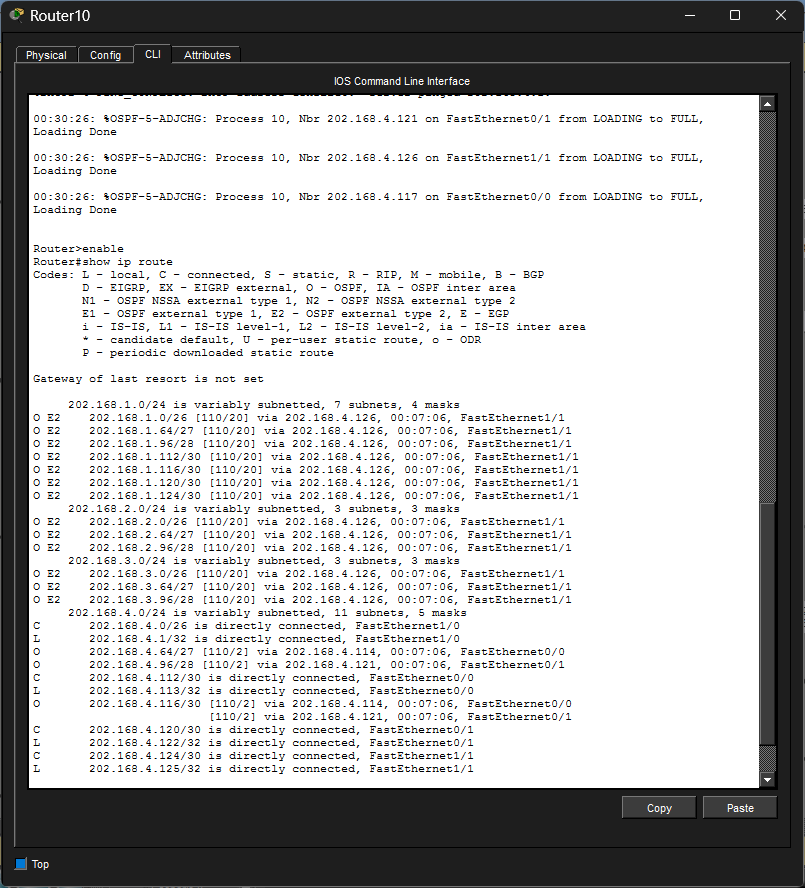
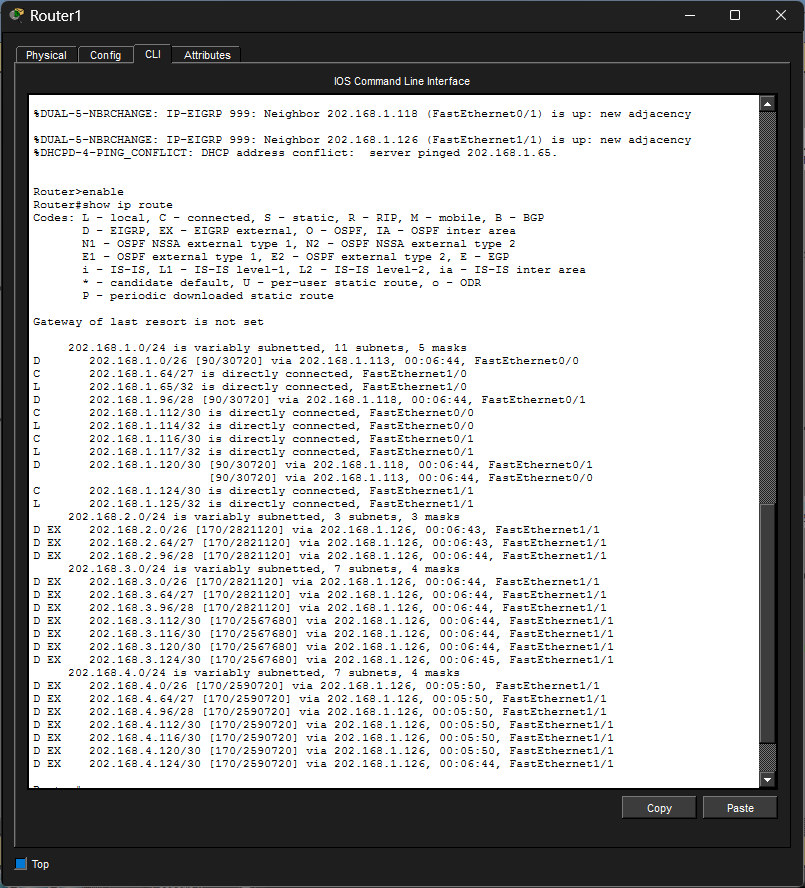
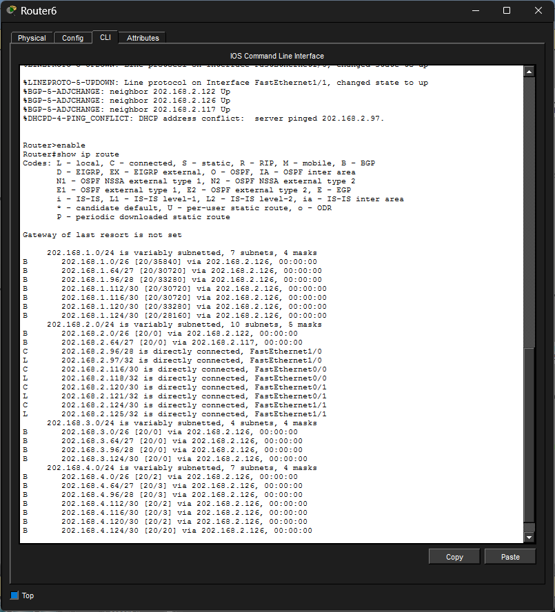
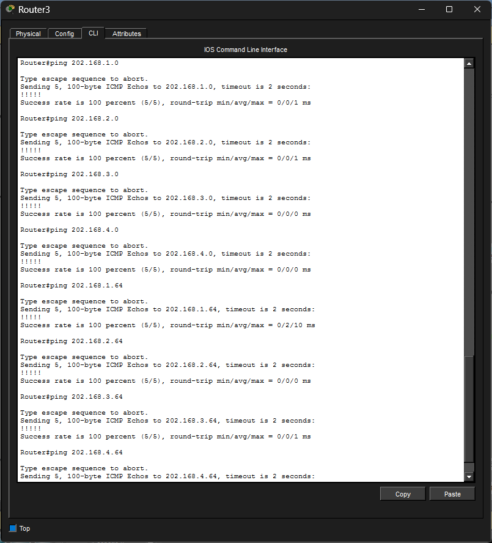

# Multi-Routing Network with Redistribution (RIP, OSPF, EIGRP, BGP)

## 📌 Project Overview
This project demonstrates a complex enterprise network integrating multiple routing protocols:
- RIP (Routing Information Protocol)
- OSPF (Open Shortest Path First)
- EIGRP (Enhanced Interior Gateway Routing Protocol)
- BGP (Border Gateway Protocol)

All routing domains are interconnected using a central router with route redistribution.

## 🛠 Technologies Used
- Cisco Packet Tracer
- RIP v2
- OSPF
- EIGRP
- BGP
- Route Redistribution
- DHCP Configuration

## 🧩 Network Design
- 4 different routing domains:
  - RIP Network
  - OSPF Network
  - EIGRP Network
  - BGP Network
- Each domain contains:
  - 3 Routers
  - 3 Switches
  - 2 PCs per switch
- Central router connects all domains

## ⚙️ Key Features
- Route Redistribution configured between all routing protocols
- DHCP used for automatic IP address allocation
- Full end-to-end connectivity achieved across all networks
- Scalable enterprise-level network design

## 🔁 Redistribution Logic
- Routes exchanged between RIP, OSPF, EIGRP, and BGP
- Ensured communication between all routing domains
- Verified using ping and routing tables

## 📷 Screenshots
## 📷 Network Topology

### 🔹 Hybrid Topology Overview
  

---

## 🔀 Routing Tables Verification

### 📡 Central Router Routing Table
(Shows routes learned from RIP, OSPF, EIGRP & BGP)

---

### 🔁 RIP Routing Table

### 🔁 OSPF Routing Table

### 🔁 EIGRP Routing Table

### 🔁 BGP Routing Table

---

## 📡 Connectivity Test (Ping Results)

### ✅ Central Router to All Networks

---

## 🧪 Verification Summary

- ✔️ Routes successfully redistributed between all protocols  
- ✔️ All routing tables populated correctly  
- ✔️ End-to-End connectivity verified using ping  
- ✔️ DHCP working across all networks  

---

## 🚀 Outcome
Successfully implemented a hybrid multi-protocol network with full connectivity and dynamic route sharing.

## 👨‍💻 Author
Riken Patel
